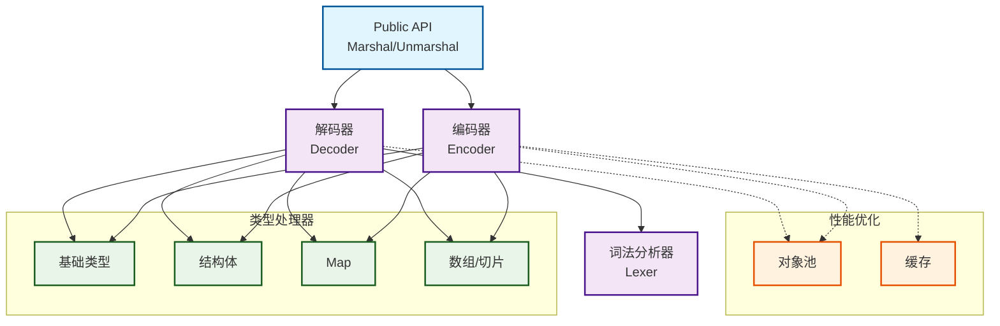

# sjson

[](https://github.com/linkxzhou/sjson/actions/workflows/ci.yml)

## 功能

sjson 是一个高性能的 Go 语言 JSON 解析库，提供了高效的 JSON 编码和解码功能。它采用直接解码技术，无需中间 Value 对象，从而提高解析效率。

## 架构



## 测试覆盖率和质量保证

本项目采用严格的质量保证流程：

- **自动化测试**: 支持 Go 1.20-1.24 多版本测试
- **代码覆盖率**: 目标覆盖率 > 90%，通过 Codecov 监控

### 运行测试

```bash
# 运行所有测试
go test -v ./...

# 运行测试并生成覆盖率报告
go test -v -race -coverprofile=coverage.out ./...
go tool cover -html=coverage.out

# 运行基准测试
go test -bench=. -benchmem ./...

# 运行代码质量检查
golangci-lint run
```

## 特性

- 简单易用的 API，与标准库 `encoding/json` 接口兼容
- 高性能直接解码器实现，无需中间 Value 对象
- 支持基本的 JSON 数据类型：null、布尔值、数字、字符串、数组和对象
- 支持结构体与 JSON 的相互转换，支持 `json` 标签
- 提供流式解析功能，可从字符串或 Reader 中解析 JSON
- 使用对象池和内存复用技术，减少内存分配和 GC 压力
- 针对常见类型和场景进行了性能优化
- 代码精简，主要逻辑代码 2000 行

## 安装

```bash
go get github.com/linkxzhou/sjson
```

## 使用示例

### 解析 JSON 字符串

```go
package main

import (
	"fmt"
	"github.com/linkxzhou/sjson"
)

func main() {
	// 解析 JSON 到 interface{}
	var data interface{}
	jsonStr := `{"name":"张三","age":30,"skills":["Go","Python"]}`
	err := sjson.Unmarshal([]byte(jsonStr), &data)
	if err != nil {
		fmt.Println("解析错误:", err)
		return
	}
	fmt.Printf("%+v\n", data)

	// 解析 JSON 到结构体
	type Person struct {
		Name   string   `json:"name"`
		Age    int      `json:"age"`
		Skills []string `json:"skills"`
	}

	var person Person
	err = sjson.Unmarshal([]byte(jsonStr), &person)
	if err != nil {
		fmt.Println("解析错误:", err)
		return
	}
	fmt.Printf("%+v\n", person)
}
```

### 生成 JSON 字符串

```go
package main

import (
	"fmt"
	"github.com/linkxzhou/sjson"
)

func main() {
	// 从结构体生成 JSON
	person := struct {
		Name   string   `json:"name"`
		Age    int      `json:"age"`
		Skills []string `json:"skills"`
	}{
		Name:   "李四",
		Age:    25,
		Skills: []string{"Java", "C++"},
	}

	data, err := sjson.Marshal(person)
	if err != nil {
		fmt.Println("编码错误:", err)
		return
	}
	fmt.Println(string(data))
}
```

### 从 Reader 解析 JSON

```go
package main

import (
	"fmt"
	"github.com/linkxzhou/sjson"
	"strings"
)

func main() {
	// 从 Reader 解析 JSON
	jsonReader := strings.NewReader(`{"success":true,"data":{"items":[1,2,3]}}`)
	
	var result struct {
		Success bool `json:"success"`
		Data    struct {
			Items []int `json:"items"`
		} `json:"data"`
	}
	
	err := sjson.UnmarshalFromReader(jsonReader, &result)
	if err != nil {
		fmt.Println("解析错误:", err)
		return
	}
	
	fmt.Printf("success: %v, items: %v\n", result.Success, result.Data.Items)
}
```

### 自定义配置

```go
package main

import (
	"fmt"
	"github.com/linkxzhou/sjson"
)

func main() {
	// 使用自定义配置
	config := sjson.Config{
		SortMapKeys: true, // 对 map 的键进行排序
	}
	
	data := map[string]interface{}{
		"z": 1,
		"a": 2,
		"m": 3,
	}
	
	// 使用自定义配置进行编码
	jsonBytes, _ := sjson.MarshalWithConfig(data, config)
	fmt.Println(string(jsonBytes)) // 输出键已排序的 JSON
}
```

## API 文档

### 解码函数

- `Unmarshal(data []byte, v interface{}) error` - 将 JSON 字节切片解析为 Go 对象
- `UnmarshalWithConfig(data []byte, v interface{}, config Config) error` - 使用自定义配置解析 JSON
- `UnmarshalFromReader(r io.Reader, v interface{}) error` - 从 Reader 解析 JSON
- `UnmarshalFromReaderWithConfig(r io.Reader, v interface{}, config Config) error` - 使用自定义配置从 Reader 解析 JSON

### 编码函数

- `Marshal(v interface{}) ([]byte, error)` - 将 Go 对象编码为 JSON 字节切片
- `MarshalString(v interface{}) (string, error)` - 将 Go 对象编码为 JSON 字符串
- `MarshalWithConfig(v interface{}, config Config) ([]byte, error)` - 使用自定义配置编码 JSON

### 配置选项

- `Config` - 用于配置 JSON 解析和编码的行为
  - `SortMapKeys` - 控制对象和 map 的键是否排序，默认不排序

## 性能优化

sjson 库采用了多种性能优化技术：

1. 直接解码：无需中间 Value 对象，直接解码到目标 Go 对象
2. 对象池：使用 sync.Pool 减少内存分配
3. 预分配内存：为数组和切片预分配适当容量
4. 类型特化：针对常见类型提供专用编码/解码路径
5. 常量缓存：预生成常用数字和字符串常量
6. 减少反射：尽可能减少反射操作，提高性能

## 性能

sjson 库的性能目标是接近或超过标准库 `encoding/json`，同时提供更简洁的 API 和更好的可扩展性。

### 1. Unmarshal 性能对比图（ns/op）

```mermaid
xychart-beta
    title "JSON Unmarshal 性能对比 (ns/op, 越低越好)"
    x-axis ["Sonic", "StdLib", "Sjson", "Jsoniter"]
    y-axis "时间 (ns/op)" 0 --> 60000
    bar "Generic" [14063, 57981, 41910, 36358]
    bar "Binding" [13697, 51432, 24466, 13520]
    bar "Parallel Generic" [3553, 14095, 12037, 12172]
    bar "Parallel Binding" [1863, 7290, 4635, 2374]
```



### 2. Unmarshal 吞吐量对比图（MB/s）

```mermaid
xychart-beta
    title "JSON Unmarshal 吞吐量对比 (MB/s, 越高越好)"
    x-axis ["Sonic", "StdLib", "Sjson", "Jsoniter"]
    y-axis "吞吐量 (MB/s)" 0 --> 6000
    bar "Generic" [789.32, 191.44, 264.85, 305.30]
    bar "Binding" [810.41, 215.82, 453.70, 821.00]
    bar "Parallel Generic" [3124.43, 787.51, 922.13, 911.90]
    bar "Parallel Binding" [5958.52, 1522.58, 2394.96, 4675.40]
```



### 3. Marshal 性能对比图（ns/op）

```mermaid
xychart-beta
    title "JSON Marshal 性能对比 (ns/op, 越低越好)"
    x-axis ["Sonic", "StdLib", "Sjson", "Jsoniter"]
    y-axis "时间 (ns/op)" 0 --> 40000
    bar "Generic" [24943, 37163, 26895, 16218]
    bar "Binding" [8457, 7152, 7881, 8418]
    bar "Parallel Generic" [5203, 10401, 9384, 3393]
    bar "Parallel Binding" [1374, 1157, 1673, 1229]
```



### 4. Marshal 吞吐量对比图（MB/s）

```mermaid
xychart-beta
    title "JSON Marshal 吞吐量对比 (MB/s, 越高越好)"
    x-axis ["Sonic", "StdLib", "Sjson", "Jsoniter"]
    y-axis "吞吐量 (MB/s)" 0 --> 10000
    bar "Generic" [445.01, 298.68, 412.71, 684.44]
    bar "Binding" [1312.49, 1552.09, 1408.42, 1318.61]
    bar "Parallel Generic" [2133.32, 1067.22, 1182.92, 3271.41]
    bar "Parallel Binding" [8075.76, 9594.99, 6635.75, 9029.83]
```



### 5. 内存分配对比图（B/op）

```mermaid
xychart-beta
    title "JSON 处理内存分配对比 (B/op, 越低越好)"
    x-axis ["Sonic", "StdLib", "Sjson", "Jsoniter"]
    y-axis "内存分配 (B/op)" 0 --> 60000
    bar "Unmarshal Generic" [43942, 49464, 45661, 54393]
    bar "Unmarshal Binding" [18540, 11416, 9404, 10704]
    bar "Marshal Generic" [13206, 32909, 19312, 17999]
    bar "Marshal Binding" [9594, 9479, 9479, 9487]
```



### 1. Unmarshal 性能测试

```
goos: darwin
goarch: arm64
pkg: github.com/linkxzhou/sjson
cpu: Apple M4 Pro
BenchmarkDecoder_Generic_Sonic-14                	  787606	     14063 ns/op	 789.32 MB/s	   43942 B/op	     106 allocs/op
BenchmarkDecoder_Generic_StdLib-14               	  199702	     57981 ns/op	 191.44 MB/s	   49464 B/op	     795 allocs/op
BenchmarkDecoder_Generic_Sjson-14                	  287949	     41910 ns/op	 264.85 MB/s	   45661 B/op	     646 allocs/op
BenchmarkDecoder_Generic_Jsoniter-14             	  331899	     36358 ns/op	 305.30 MB/s	   54393 B/op	    1091 allocs/op
BenchmarkDecoder_Binding_Sonic-14                	  855504	     13697 ns/op	 810.41 MB/s	   18540 B/op	      42 allocs/op
BenchmarkDecoder_Binding_StdLib-14               	  237805	     51432 ns/op	 215.82 MB/s	   11416 B/op	     160 allocs/op
BenchmarkDecoder_Binding_Sjson-14                	  489140	     24466 ns/op	 453.70 MB/s	    9404 B/op	      81 allocs/op
BenchmarkDecoder_Binding_Jsoniter-14             	  889518	     13520 ns/op	 821.00 MB/s	   10704 B/op	     145 allocs/op
BenchmarkDecoder_Parallel_Generic_Sonic-14       	 3355818	      3553 ns/op	3124.43 MB/s	   44571 B/op	     106 allocs/op
BenchmarkDecoder_Parallel_Generic_StdLib-14      	  851678	     14095 ns/op	 787.51 MB/s	   49466 B/op	     795 allocs/op
BenchmarkDecoder_Parallel_Generic_Sjson-14       	 1000000	     12037 ns/op	 922.13 MB/s	   45596 B/op	     646 allocs/op
BenchmarkDecoder_Parallel_Generic_Jsoniter-14    	  962308	     12172 ns/op	 911.90 MB/s	   54355 B/op	    1091 allocs/op
BenchmarkDecoder_Parallel_Binding_Sonic-14       	 6418424	      1863 ns/op	5958.52 MB/s	   22165 B/op	      42 allocs/op
BenchmarkDecoder_Parallel_Binding_StdLib-14      	 1638642	      7290 ns/op	1522.58 MB/s	   11416 B/op	     160 allocs/op
BenchmarkDecoder_Parallel_Binding_Sjson-14       	 2597790	      4635 ns/op	2394.96 MB/s	    9394 B/op	      81 allocs/op
BenchmarkDecoder_Parallel_Binding_Jsoniter-14    	 5138331	      2374 ns/op	4675.40 MB/s	   10698 B/op	     145 allocs/op
PASS
```

### 2. Marshal 性能测试

```
goos: darwin
goarch: arm64
pkg: github.com/linkxzhou/sjson
cpu: Apple M4 Pro
BenchmarkEncoder_Generic_Sonic-14                	  461450	     24943 ns/op	 445.01 MB/s	   13206 B/op	      40 allocs/op
BenchmarkEncoder_Generic_StdLib-14               	  323244	     37163 ns/op	 298.68 MB/s	   32909 B/op	     653 allocs/op
BenchmarkEncoder_Generic_Sjson-14                	  458061	     26895 ns/op	 412.71 MB/s	   19312 B/op	     615 allocs/op
BenchmarkEncoder_Generic_Jsoniter-14             	  737346	     16218 ns/op	 684.44 MB/s	   17999 B/op	     153 allocs/op
BenchmarkEncoder_Binding_Sonic-14                	 1411100	      8457 ns/op	1312.49 MB/s	    9594 B/op	       2 allocs/op
BenchmarkEncoder_Binding_StdLib-14               	 1694758	      7152 ns/op	1552.09 MB/s	    9479 B/op	       1 allocs/op
BenchmarkEncoder_Binding_Sjson-14                	 1489347	      7881 ns/op	1408.42 MB/s	    9479 B/op	       1 allocs/op
BenchmarkEncoder_Binding_Jsoniter-14             	 1447657	      8418 ns/op	1318.61 MB/s	    9487 B/op	       2 allocs/op
BenchmarkEncoder_Parallel_Generic_Sonic-14       	 2311245	      5203 ns/op	2133.32 MB/s	   13514 B/op	      40 allocs/op
BenchmarkEncoder_Parallel_Generic_StdLib-14      	 1000000	     10401 ns/op	1067.22 MB/s	   32889 B/op	     653 allocs/op
BenchmarkEncoder_Parallel_Generic_Sjson-14       	 1477161	      9384 ns/op	1182.92 MB/s	   19303 B/op	     615 allocs/op
BenchmarkEncoder_Parallel_Generic_Jsoniter-14    	 3501370	      3393 ns/op	3271.41 MB/s	   17988 B/op	     153 allocs/op
BenchmarkEncoder_Parallel_Binding_Sonic-14       	 9277832	      1374 ns/op	8075.76 MB/s	    9961 B/op	       2 allocs/op
BenchmarkEncoder_Parallel_Binding_StdLib-14      	10717603	      1157 ns/op	9594.99 MB/s	    9473 B/op	       1 allocs/op
BenchmarkEncoder_Parallel_Binding_Sjson-14       	 8119550	      1673 ns/op	6635.75 MB/s	    9474 B/op	       1 allocs/op
BenchmarkEncoder_Parallel_Binding_Jsoniter-14    	 9656658	      1229 ns/op	9029.83 MB/s	    9481 B/op	       2 allocs/op
PASS
```