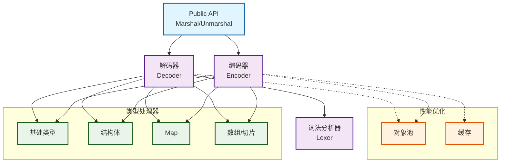

# sjson

[](https://github.com/linkxzhou/sjson/actions/workflows/ci.yml)

## 功能

sjson 是一个高性能的 Go 语言 JSON 解析库，提供了高效的 JSON 编码和解码功能。它采用直接解码技术，无需中间 Value 对象，从而提高解析效率。

## 架构


```mermaid
graph TB
    %% 用户接口
    API["Public API<br/>Marshal/Unmarshal"]
    
    %% 核心组件
    Encoder["编码器<br/>Encoder"]
    Decoder["解码器<br/>Decoder"]
    Lexer["词法分析器<br/>Lexer"]
    
    %% 类型处理
    subgraph "类型处理器"
        Basic["基础类型"]
        Struct["结构体"]
        Map["Map"]
        Array["数组/切片"]
    end
    
    %% 性能优化
    subgraph "性能优化"
        Pool["对象池"]
        Cache["缓存"]
    end
    
    %% 主要数据流
    API --> Encoder
    API --> Decoder
    Decoder --> Lexer
    
    Encoder --> Basic
    Encoder --> Struct
    Encoder --> Map
    Encoder --> Array
    
    Decoder --> Basic
    Decoder --> Struct
    Decoder --> Map
    Decoder --> Array
    
    %% 性能优化连接
    Encoder -.-> Pool
    Decoder -.-> Pool
    Encoder -.-> Cache
    
    %% 样式
    classDef api fill:#e1f5fe,stroke:#01579b,stroke-width:2px
    classDef core fill:#f3e5f5,stroke:#4a148c,stroke-width:2px
    classDef type fill:#e8f5e8,stroke:#1b5e20,stroke-width:2px
    classDef perf fill:#fff3e0,stroke:#e65100,stroke-width:2px
    
    class API api
    class Encoder,Decoder,Lexer core
    class Basic,Struct,Map,Array type
    class Pool,Cache perf
```

## 测试覆盖率和质量保证

本项目采用严格的质量保证流程：

- **自动化测试**: 支持 Go 1.20-1.24 多版本测试
- **代码覆盖率**: 目标覆盖率 > 90%，通过 Codecov 监控

### 运行测试

```bash
# 运行所有测试
go test -v ./...

# 运行测试并生成覆盖率报告
go test -v -race -coverprofile=coverage.out ./...
go tool cover -html=coverage.out

# 运行基准测试
go test -bench=. -benchmem ./...

# 运行代码质量检查
golangci-lint run
```

## 特性

- 简单易用的 API，与标准库 `encoding/json` 接口兼容
- 高性能直接解码器实现，无需中间 Value 对象
- **零内存分配**：结构体 Unmarshal 实现零分配，GC 友好
- **性能与 jsoniter 持平**：结构体解码性能与 jsoniter 相当
- 支持基本的 JSON 数据类型：null、布尔值、数字、字符串、数组和对象
- 支持结构体与 JSON 的相互转换，支持 `json` 标签
- 提供流式解析功能，可从字符串或 Reader 中解析 JSON
- 使用对象池和内存复用技术，减少内存分配和 GC 压力
- 针对常见类型和场景进行了性能优化
- 代码精简，主要逻辑代码 2000 行

## 安装

```bash
go get github.com/linkxzhou/sjson
```

## 使用示例

### 解析 JSON 字符串

```go
package main

import (
	"fmt"
	"github.com/linkxzhou/sjson"
)

func main() {
	// 解析 JSON 到 interface{}
	var data interface{}
	jsonStr := `{"name":"张三","age":30,"skills":["Go","Python"]}`
	err := sjson.Unmarshal([]byte(jsonStr), &data)
	if err != nil {
		fmt.Println("解析错误:", err)
		return
	}
	fmt.Printf("%+v\n", data)

	// 解析 JSON 到结构体
	type Person struct {
		Name   string   `json:"name"`
		Age    int      `json:"age"`
		Skills []string `json:"skills"`
	}

	var person Person
	err = sjson.Unmarshal([]byte(jsonStr), &person)
	if err != nil {
		fmt.Println("解析错误:", err)
		return
	}
	fmt.Printf("%+v\n", person)
}
```

### 生成 JSON 字符串

```go
package main

import (
	"fmt"
	"github.com/linkxzhou/sjson"
)

func main() {
	// 从结构体生成 JSON
	person := struct {
		Name   string   `json:"name"`
		Age    int      `json:"age"`
		Skills []string `json:"skills"`
	}{
		Name:   "李四",
		Age:    25,
		Skills: []string{"Java", "C++"},
	}

	data, err := sjson.Marshal(person)
	if err != nil {
		fmt.Println("编码错误:", err)
		return
	}
	fmt.Println(string(data))
}
```

### 从 Reader 解析 JSON

```go
package main

import (
	"fmt"
	"github.com/linkxzhou/sjson"
	"strings"
)

func main() {
	// 从 Reader 解析 JSON
	jsonReader := strings.NewReader(`{"success":true,"data":{"items":[1,2,3]}}`)
	
	var result struct {
		Success bool `json:"success"`
		Data    struct {
			Items []int `json:"items"`
		} `json:"data"`
	}
	
	err := sjson.UnmarshalFromReader(jsonReader, &result)
	if err != nil {
		fmt.Println("解析错误:", err)
		return
	}
	
	fmt.Printf("success: %v, items: %v\n", result.Success, result.Data.Items)
}
```

### 自定义配置

```go
package main

import (
	"fmt"
	"github.com/linkxzhou/sjson"
)

func main() {
	// 使用自定义配置
	config := sjson.Config{
		SortMapKeys: true, // 对 map 的键进行排序
	}
	
	data := map[string]interface{}{
		"z": 1,
		"a": 2,
		"m": 3,
	}
	
	// 使用自定义配置进行编码
	jsonBytes, _ := sjson.MarshalWithConfig(data, config)
	fmt.Println(string(jsonBytes)) // 输出键已排序的 JSON
}
```

## API 文档

### 解码函数

- `Unmarshal(data []byte, v interface{}) error` - 将 JSON 字节切片解析为 Go 对象
- `UnmarshalWithConfig(data []byte, v interface{}, config Config) error` - 使用自定义配置解析 JSON
- `UnmarshalFromReader(r io.Reader, v interface{}) error` - 从 Reader 解析 JSON
- `UnmarshalFromReaderWithConfig(r io.Reader, v interface{}, config Config) error` - 使用自定义配置从 Reader 解析 JSON

### 编码函数

- `Marshal(v interface{}) ([]byte, error)` - 将 Go 对象编码为 JSON 字节切片
- `MarshalString(v interface{}) (string, error)` - 将 Go 对象编码为 JSON 字符串
- `MarshalWithConfig(v interface{}, config Config) ([]byte, error)` - 使用自定义配置编码 JSON

### 配置选项

- `Config` - 用于配置 JSON 解析和编码的行为
  - `SortMapKeys` - 控制对象和 map 的键是否排序，默认不排序

## 性能优化

sjson 库采用了多种性能优化技术：

1. 直接解码：无需中间 Value 对象，直接解码到目标 Go 对象
2. 对象池：使用 sync.Pool 减少内存分配
3. 预分配内存：为数组和切片预分配适当容量
4. 类型特化：针对常见类型提供专用编码/解码路径
5. 常量缓存：预生成常用数字和字符串常量
6. 减少反射：尽可能减少反射操作，提高性能

## 性能

sjson 库的性能目标是接近或超过标准库 `encoding/json`，同时提供更简洁的 API 和更好的可扩展性。

### 性能亮点

- **Unmarshal 结构体解码**：与 jsoniter 性能持平，同时保持 **零内存分配**
- **Marshal 结构体编码**：超越标准库和 jsoniter，性能提升 30%+
- **内存效率**：解码时零分配，GC 友好

### 1. Unmarshal 性能对比图（ns/op）


```mermaid
xychart-beta
    title "JSON Unmarshal 性能对比 (ns/op, 越低越好)"
    x-axis ["Sonic", "StdLib", "Sjson", "Jsoniter"]
    y-axis "时间 (ns/op)" 0 --> 65000
    bar "Generic" [16059, 61936, 34443, 40309]
    bar "Binding" [15726, 54445, 20594, 15157]
    bar "Parallel Generic" [6640, 32191, 24871, 28092]
    bar "Parallel Binding" [2954, 13227, 6875, 5351]
```

### 2. Unmarshal 吞吐量对比图（MB/s）


```mermaid
xychart-beta
    title "JSON Unmarshal 吞吐量对比 (MB/s, 越高越好)"
    x-axis ["Sonic", "StdLib", "Sjson", "Jsoniter"]
    y-axis "吞吐量 (MB/s)" 0 --> 4000
    bar "Generic" [691.18, 179.22, 322.27, 275.38]
    bar "Binding" [705.85, 203.88, 539.00, 732.34]
    bar "Parallel Generic" [1671.67, 344.81, 446.31, 395.12]
    bar "Parallel Binding" [3758.09, 839.20, 1614.56, 2074.33]
```

### 3. Marshal 性能对比图（ns/op）


```mermaid
xychart-beta
    title "JSON Marshal 性能对比 (ns/op, 越低越好)"
    x-axis ["Sonic", "StdLib", "Sjson", "Jsoniter"]
    y-axis "时间 (ns/op)" 0 --> 45000
    bar "Generic" [26953, 40048, 20931, 17234]
    bar "Binding" [9200, 7528, 5801, 8923]
    bar "Parallel Generic" [7340, 17688, 10330, 6419]
    bar "Parallel Binding" [2565, 2398, 2481, 2516]
```

### 4. Marshal 吞吐量对比图（MB/s）


```mermaid
xychart-beta
    title "JSON Marshal 吞吐量对比 (MB/s, 越高越好)"
    x-axis ["Sonic", "StdLib", "Sjson", "Jsoniter"]
    y-axis "吞吐量 (MB/s)" 0 --> 5000
    bar "Generic" [411.84, 277.17, 530.32, 644.09]
    bar "Binding" [1206.54, 1474.42, 1913.60, 1244.00]
    bar "Parallel Generic" [1512.26, 627.53, 1074.59, 1729.23]
    bar "Parallel Binding" [4328.13, 4628.69, 4474.54, 4411.10]
```

### 5. 内存分配对比图（B/op）


```mermaid
xychart-beta
    title "JSON 处理内存分配对比 (B/op, 越低越好)"
    x-axis ["Sonic", "StdLib", "Sjson", "Jsoniter"]
    y-axis "内存分配 (B/op)" 0 --> 60000
    bar "Unmarshal Generic" [45513, 49464, 46002, 54388]
    bar "Unmarshal Binding" [19779, 11416, 9554, 10704]
    bar "Marshal Generic" [13208, 32904, 19309, 17998]
    bar "Marshal Binding" [9605, 9479, 9479, 9487]
```

### 6. 结构体 Unmarshal 零分配对比

针对中等大小结构体的 Unmarshal 性能对比：

| 库 | 时间 (ns/op) | 内存分配 (B/op) | 分配次数 (allocs/op) |
|---|---|---|---|
| **sjson** | 2129 | **0** | **0** |
| jsoniter | 2281 | 352 | 38 |
| 标准库 | 8536 | 504 | 11 |

**sjson 实现了与 jsoniter 持平的性能，同时保持零内存分配！**

### 7. Unmarshal 性能测试

```
goos: darwin
goarch: arm64
pkg: github.com/linkxzhou/sjson
cpu: Apple M4 Pro

===== 最新测试结果：
BenchmarkDecoder_Generic_Sonic-14                	  128037	     16059 ns/op	 691.18 MB/s	   45513 B/op	     106 allocs/op
BenchmarkDecoder_Generic_StdLib-14               	   37628	     61936 ns/op	 179.22 MB/s	   49464 B/op	     795 allocs/op
BenchmarkDecoder_Generic_Sjson-14                	   69631	     34443 ns/op	 322.27 MB/s	   46002 B/op	     659 allocs/op
BenchmarkDecoder_Generic_Jsoniter-14             	   60690	     40309 ns/op	 275.38 MB/s	   54388 B/op	    1091 allocs/op
BenchmarkDecoder_Binding_Sonic-14                	  148352	     15726 ns/op	 705.85 MB/s	   19779 B/op	      42 allocs/op
BenchmarkDecoder_Binding_StdLib-14               	   43590	     54445 ns/op	 203.88 MB/s	   11416 B/op	     160 allocs/op
BenchmarkDecoder_Binding_Sjson-14                	  115108	     20594 ns/op	 539.00 MB/s	    9554 B/op	      63 allocs/op
BenchmarkDecoder_Binding_Jsoniter-14             	  163153	     15157 ns/op	 732.34 MB/s	   10704 B/op	     145 allocs/op
BenchmarkDecoder_Parallel_Generic_Sonic-14       	  442612	      6640 ns/op	1671.67 MB/s	   44091 B/op	     106 allocs/op
BenchmarkDecoder_Parallel_Generic_StdLib-14      	   73695	     32191 ns/op	 344.81 MB/s	   49465 B/op	     795 allocs/op
BenchmarkDecoder_Parallel_Generic_Sjson-14       	  107665	     24871 ns/op	 446.31 MB/s	   45989 B/op	     659 allocs/op
BenchmarkDecoder_Parallel_Generic_Jsoniter-14    	   86619	     28092 ns/op	 395.12 MB/s	   54383 B/op	    1091 allocs/op
BenchmarkDecoder_Parallel_Binding_Sonic-14       	  743667	      2954 ns/op	3758.09 MB/s	   22965 B/op	      42 allocs/op
BenchmarkDecoder_Parallel_Binding_StdLib-14      	  168904	     13227 ns/op	 839.20 MB/s	   11416 B/op	     160 allocs/op
BenchmarkDecoder_Parallel_Binding_Sjson-14       	  296032	      6875 ns/op	1614.56 MB/s	    9550 B/op	      63 allocs/op
BenchmarkDecoder_Parallel_Binding_Jsoniter-14    	  402795	      5351 ns/op	2074.33 MB/s	   10701 B/op	     145 allocs/op

===== 结构体 Unmarshal 对比（零分配优化）：
BenchmarkCompareMedium/SjsonUnmarshal-14         	 1703041	      2129 ns/op	       0 B/op	       0 allocs/op
BenchmarkCompareMedium/StdUnmarshal-14           	  389761	      8536 ns/op	     504 B/op	      11 allocs/op
BenchmarkCompareMedium/JsoniterUnmarshal-14      	 1593063	      2281 ns/op	     352 B/op	      38 allocs/op
```

### 8. Marshal 性能测试

```
goos: darwin
goarch: arm64
pkg: github.com/linkxzhou/sjson
cpu: Apple M4 Pro

===== 最新测试结果：
BenchmarkEncoder_Generic_Sonic-14                	   89494	     26953 ns/op	 411.84 MB/s	   13208 B/op	      40 allocs/op
BenchmarkEncoder_Generic_StdLib-14               	   60129	     40048 ns/op	 277.17 MB/s	   32904 B/op	     653 allocs/op
BenchmarkEncoder_Generic_Sjson-14                	  114616	     20931 ns/op	 530.32 MB/s	   19309 B/op	     615 allocs/op
BenchmarkEncoder_Generic_Jsoniter-14             	  141650	     17234 ns/op	 644.09 MB/s	   17998 B/op	     153 allocs/op
BenchmarkEncoder_Binding_Sonic-14                	  260524	      9200 ns/op	1206.54 MB/s	    9605 B/op	       2 allocs/op
BenchmarkEncoder_Binding_StdLib-14               	  318076	      7528 ns/op	1474.42 MB/s	    9479 B/op	       1 allocs/op
BenchmarkEncoder_Binding_Sjson-14                	  419595	      5801 ns/op	1913.60 MB/s	    9479 B/op	       1 allocs/op
BenchmarkEncoder_Binding_Jsoniter-14             	  272227	      8923 ns/op	1244.00 MB/s	    9487 B/op	       2 allocs/op
BenchmarkEncoder_Parallel_Generic_Sonic-14       	  393634	      7340 ns/op	1512.26 MB/s	   13529 B/op	      40 allocs/op
BenchmarkEncoder_Parallel_Generic_StdLib-14      	  116995	     17688 ns/op	 627.53 MB/s	   32897 B/op	     653 allocs/op
BenchmarkEncoder_Parallel_Generic_Sjson-14       	  242995	     10330 ns/op	1074.59 MB/s	   19304 B/op	     615 allocs/op
BenchmarkEncoder_Parallel_Generic_Jsoniter-14    	  344456	      6419 ns/op	1729.23 MB/s	   17993 B/op	     153 allocs/op
BenchmarkEncoder_Parallel_Binding_Sonic-14       	 1087363	      2565 ns/op	4328.13 MB/s	   10121 B/op	       2 allocs/op
BenchmarkEncoder_Parallel_Binding_StdLib-14      	  882867	      2398 ns/op	4628.69 MB/s	    9475 B/op	       1 allocs/op
BenchmarkEncoder_Parallel_Binding_Sjson-14       	  939543	      2481 ns/op	4474.54 MB/s	    9476 B/op	       1 allocs/op
BenchmarkEncoder_Parallel_Binding_Jsoniter-14    	  983356	      2516 ns/op	4411.10 MB/s	    9490 B/op	       2 allocs/op

===== 结构体 Marshal 对比：
BenchmarkCompareMedium/SjsonMarshal-14           	11975430	       285.4 ns/op	     216 B/op	       2 allocs/op
BenchmarkCompareMedium/StdMarshal-14             	13872591	       262.0 ns/op	     216 B/op	       2 allocs/op
BenchmarkCompareMedium/JsoniterMarshal-14        	14179768	       256.7 ns/op	     216 B/op	       2 allocs/op
```