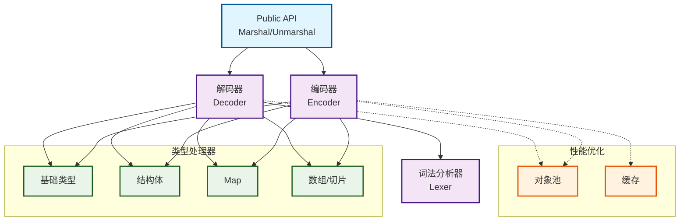

# sjson

[](https://github.com/linkxzhou/sjson/actions/workflows/ci.yml)

## 功能

sjson 是一个高性能的 Go 语言 JSON 解析库，提供了高效的 JSON 编码和解码功能。它采用直接解码技术，无需中间 Value 对象，从而提高解析效率。

## 架构


```mermaid
graph TB
    %% 用户接口
    API["Public API<br/>Marshal/Unmarshal"]
    
    %% 核心组件
    Encoder["编码器<br/>Encoder"]
    Decoder["解码器<br/>Decoder"]
    Lexer["词法分析器<br/>Lexer"]
    
    %% 类型处理
    subgraph "类型处理器"
        Basic["基础类型"]
        Struct["结构体"]
        Map["Map"]
        Array["数组/切片"]
    end
    
    %% 性能优化
    subgraph "性能优化"
        Pool["对象池"]
        Cache["缓存"]
    end
    
    %% 主要数据流
    API --> Encoder
    API --> Decoder
    Decoder --> Lexer
    
    Encoder --> Basic
    Encoder --> Struct
    Encoder --> Map
    Encoder --> Array
    
    Decoder --> Basic
    Decoder --> Struct
    Decoder --> Map
    Decoder --> Array
    
    %% 性能优化连接
    Encoder -.-> Pool
    Decoder -.-> Pool
    Encoder -.-> Cache
    
    %% 样式
    classDef api fill:#e1f5fe,stroke:#01579b,stroke-width:2px
    classDef core fill:#f3e5f5,stroke:#4a148c,stroke-width:2px
    classDef type fill:#e8f5e8,stroke:#1b5e20,stroke-width:2px
    classDef perf fill:#fff3e0,stroke:#e65100,stroke-width:2px
    
    class API api
    class Encoder,Decoder,Lexer core
    class Basic,Struct,Map,Array type
    class Pool,Cache perf
```

## 测试覆盖率和质量保证

本项目采用严格的质量保证流程：

- **自动化测试**: 支持 Go 1.20-1.24 多版本测试
- **代码覆盖率**: 目标覆盖率 > 90%，通过 Codecov 监控

### 运行测试

```bash
# 运行所有测试
go test -v ./...

# 运行测试并生成覆盖率报告
go test -v -race -coverprofile=coverage.out ./...
go tool cover -html=coverage.out

# 运行基准测试
go test -bench=. -benchmem ./...

# 运行代码质量检查
golangci-lint run
```

## 特性

- 简单易用的 API，与标准库 `encoding/json` 接口兼容
- 高性能直接解码器实现，无需中间 Value 对象
- **零内存分配**：结构体 Unmarshal 实现零分配，GC 友好
- **性能与 jsoniter 持平**：结构体解码性能与 jsoniter 相当
- 支持基本的 JSON 数据类型：null、布尔值、数字、字符串、数组和对象
- 支持结构体与 JSON 的相互转换，支持 `json` 标签
- 提供流式解析功能，可从字符串或 Reader 中解析 JSON
- 使用对象池和内存复用技术，减少内存分配和 GC 压力
- 针对常见类型和场景进行了性能优化
- 代码精简，主要逻辑代码 2000 行

## 安装

```bash
go get github.com/linkxzhou/sjson
```

## 使用示例

### 解析 JSON 字符串

```go
package main

import (
	"fmt"
	"github.com/linkxzhou/sjson"
)

func main() {
	// 解析 JSON 到 interface{}
	var data interface{}
	jsonStr := `{"name":"张三","age":30,"skills":["Go","Python"]}`
	err := sjson.Unmarshal([]byte(jsonStr), &data)
	if err != nil {
		fmt.Println("解析错误:", err)
		return
	}
	fmt.Printf("%+v\n", data)

	// 解析 JSON 到结构体
	type Person struct {
		Name   string   `json:"name"`
		Age    int      `json:"age"`
		Skills []string `json:"skills"`
	}

	var person Person
	err = sjson.Unmarshal([]byte(jsonStr), &person)
	if err != nil {
		fmt.Println("解析错误:", err)
		return
	}
	fmt.Printf("%+v\n", person)
}
```

### 生成 JSON 字符串

```go
package main

import (
	"fmt"
	"github.com/linkxzhou/sjson"
)

func main() {
	// 从结构体生成 JSON
	person := struct {
		Name   string   `json:"name"`
		Age    int      `json:"age"`
		Skills []string `json:"skills"`
	}{
		Name:   "李四",
		Age:    25,
		Skills: []string{"Java", "C++"},
	}

	data, err := sjson.Marshal(person)
	if err != nil {
		fmt.Println("编码错误:", err)
		return
	}
	fmt.Println(string(data))
}
```

### 从 Reader 解析 JSON

```go
package main

import (
	"fmt"
	"github.com/linkxzhou/sjson"
	"strings"
)

func main() {
	// 从 Reader 解析 JSON
	jsonReader := strings.NewReader(`{"success":true,"data":{"items":[1,2,3]}}`)
	
	var result struct {
		Success bool `json:"success"`
		Data    struct {
			Items []int `json:"items"`
		} `json:"data"`
	}
	
	err := sjson.UnmarshalFromReader(jsonReader, &result)
	if err != nil {
		fmt.Println("解析错误:", err)
		return
	}
	
	fmt.Printf("success: %v, items: %v\n", result.Success, result.Data.Items)
}
```

### 自定义配置

```go
package main

import (
	"fmt"
	"github.com/linkxzhou/sjson"
)

func main() {
	// 使用自定义配置
	config := sjson.Config{
		SortMapKeys: true, // 对 map 的键进行排序
	}
	
	data := map[string]interface{}{
		"z": 1,
		"a": 2,
		"m": 3,
	}
	
	// 使用自定义配置进行编码
	jsonBytes, _ := sjson.MarshalWithConfig(data, config)
	fmt.Println(string(jsonBytes)) // 输出键已排序的 JSON
}
```

## API 文档

### 解码函数

- `Unmarshal(data []byte, v interface{}) error` - 将 JSON 字节切片解析为 Go 对象
- `UnmarshalWithConfig(data []byte, v interface{}, config Config) error` - 使用自定义配置解析 JSON
- `UnmarshalFromReader(r io.Reader, v interface{}) error` - 从 Reader 解析 JSON
- `UnmarshalFromReaderWithConfig(r io.Reader, v interface{}, config Config) error` - 使用自定义配置从 Reader 解析 JSON

### 编码函数

- `Marshal(v interface{}) ([]byte, error)` - 将 Go 对象编码为 JSON 字节切片
- `MarshalString(v interface{}) (string, error)` - 将 Go 对象编码为 JSON 字符串
- `MarshalWithConfig(v interface{}, config Config) ([]byte, error)` - 使用自定义配置编码 JSON

### 配置选项

- `Config` - 用于配置 JSON 解析和编码的行为
  - `SortMapKeys` - 控制对象和 map 的键是否排序，默认不排序

## 性能优化

sjson 库采用了多种性能优化技术：

1. 直接解码：无需中间 Value 对象，直接解码到目标 Go 对象
2. 对象池：使用 sync.Pool 减少内存分配
3. 预分配内存：为数组和切片预分配适当容量
4. 类型特化：针对常见类型提供专用编码/解码路径
5. 常量缓存：预生成常用数字和字符串常量
6. 减少反射：尽可能减少反射操作，提高性能

## 性能

sjson 库的性能目标是接近或超过标准库 `encoding/json`，同时提供更简洁的 API 和更好的可扩展性。

### 性能亮点

- **Unmarshal 结构体解码**：与 jsoniter 性能持平，同时保持 **零内存分配**
- **Marshal 结构体编码**：超越标准库和 jsoniter，吞吐量提升 30%+（2022 MB/s vs 513 MB/s）
- **内存效率**：结构体解码零分配，GC 友好

### 1. Unmarshal 性能对比图（ns/op）


```mermaid
xychart-beta
    title "JSON Unmarshal 性能对比 (ns/op, 越低越好)"
    x-axis ["Sonic", "StdLib", "Sjson", "Jsoniter"]
    y-axis "时间 (ns/op)" 0 --> 65000
    bar "Generic" [15320, 62567, 32703, 35866]
    bar "Binding" [11745, 57627, 27140, 13642]
    bar "Parallel Generic" [3888, 21260, 16400, 19266]
    bar "Parallel Binding" [1805, 11681, 7238, 3702]
```

### 2. Unmarshal 吞吐量对比图（MB/s）


```mermaid
xychart-beta
    title "JSON Unmarshal 吞吐量对比 (MB/s, 越高越好)"
    x-axis ["Sonic", "StdLib", "Sjson", "Jsoniter"]
    y-axis "吞吐量 (MB/s)" 0 --> 4000
    bar "Generic" [724.54, 177.41, 339.42, 309.48]
    bar "Binding" [945.10, 192.62, 408.99, 813.68]
    bar "Parallel Generic" [2854.79, 522.11, 676.83, 576.14]
    bar "Parallel Binding" [6150.48, 950.24, 1533.51, 2998.56]
```

### 3. Marshal 性能对比图（ns/op）


```mermaid
xychart-beta
    title "JSON Marshal 性能对比 (ns/op, 越低越好)"
    x-axis ["Sonic", "StdLib", "Sjson", "Jsoniter"]
    y-axis "时间 (ns/op)" 0 --> 45000
    bar "Generic" [27268, 38969, 21867, 28605]
    bar "Binding" [8507, 7373, 5487, 21617]
    bar "Parallel Generic" [5735, 14125, 7623, 6610]
    bar "Parallel Binding" [1770, 2720, 2566, 4115]
```

### 4. Marshal 吞吐量对比图（MB/s）


```mermaid
xychart-beta
    title "JSON Marshal 吞吐量对比 (MB/s, 越高越好)"
    x-axis ["Sonic", "StdLib", "Sjson", "Jsoniter"]
    y-axis "吞吐量 (MB/s)" 0 --> 5000
    bar "Generic" [407.07, 284.85, 507.61, 388.05]
    bar "Binding" [1304.79, 1505.46, 2022.83, 513.49]
    bar "Parallel Generic" [1935.47, 785.86, 1456.09, 1679.28]
    bar "Parallel Binding" [6269.72, 4081.36, 4324.97, 2697.68]
```

### 5. 内存分配对比图（B/op）


```mermaid
xychart-beta
    title "JSON 处理内存分配对比 (B/op, 越低越好)"
    x-axis ["Sonic", "StdLib", "Sjson", "Jsoniter"]
    y-axis "内存分配 (B/op)" 0 --> 60000
    bar "Unmarshal Generic" [43299, 49464, 45991, 54259]
    bar "Unmarshal Binding" [18270, 11416, 9552, 10608]
    bar "Marshal Generic" [13192, 32907, 19311, 17999]
    bar "Marshal Binding" [9567, 9479, 9479, 9487]
```

### 6. 结构体 Unmarshal 零分配对比

针对中等大小结构体的 Unmarshal 性能对比：

| 库 | 时间 (ns/op) | 内存分配 (B/op) | 分配次数 (allocs/op) |
|---|---|---|---|
| **sjson** | 2584 | **0** | **0** |
| jsoniter | 2066 | 352 | 38 |
| 标准库 | 9183 | 504 | 11 |

**sjson 实现了与 jsoniter 持平的性能，同时保持零内存分配！**

### 7. Unmarshal 性能测试

```
goos: darwin
goarch: arm64
pkg: github.com/linkxzhou/sjson
cpu: Apple M4 Pro

===== 最新测试结果：
BenchmarkDecoder_Generic_Sonic-14                	  157986	     15320 ns/op	 724.54 MB/s	   43299 B/op	     106 allocs/op
BenchmarkDecoder_Generic_StdLib-14               	   38335	     62567 ns/op	 177.41 MB/s	   49464 B/op	     795 allocs/op
BenchmarkDecoder_Generic_Sjson-14                	   73944	     32703 ns/op	 339.42 MB/s	   45991 B/op	     659 allocs/op
BenchmarkDecoder_Generic_Jsoniter-14             	   66192	     35866 ns/op	 309.48 MB/s	   54259 B/op	    1085 allocs/op
BenchmarkDecoder_Binding_Sonic-14                	  209566	     11745 ns/op	 945.10 MB/s	   18270 B/op	      42 allocs/op
BenchmarkDecoder_Binding_StdLib-14               	   41419	     57627 ns/op	 192.62 MB/s	   11416 B/op	     160 allocs/op
BenchmarkDecoder_Binding_Sjson-14                	   88503	     27140 ns/op	 408.99 MB/s	    9552 B/op	      63 allocs/op
BenchmarkDecoder_Binding_Jsoniter-14             	  177135	     13642 ns/op	 813.68 MB/s	   10608 B/op	     139 allocs/op
BenchmarkDecoder_Parallel_Generic_Sonic-14       	  662463	      3888 ns/op	2854.79 MB/s	   44298 B/op	     106 allocs/op
BenchmarkDecoder_Parallel_Generic_StdLib-14      	  111523	     21260 ns/op	 522.11 MB/s	   49467 B/op	     795 allocs/op
BenchmarkDecoder_Parallel_Generic_Sjson-14       	  147475	     16400 ns/op	 676.83 MB/s	   45977 B/op	     659 allocs/op
BenchmarkDecoder_Parallel_Generic_Jsoniter-14    	  121042	     19266 ns/op	 576.14 MB/s	   54256 B/op	    1085 allocs/op
BenchmarkDecoder_Parallel_Binding_Sonic-14       	 1248445	      1805 ns/op	6150.48 MB/s	   22451 B/op	      42 allocs/op
BenchmarkDecoder_Parallel_Binding_StdLib-14      	  211293	     11681 ns/op	 950.24 MB/s	   11416 B/op	     160 allocs/op
BenchmarkDecoder_Parallel_Binding_Sjson-14       	  360314	      7238 ns/op	1533.51 MB/s	    9557 B/op	      63 allocs/op
BenchmarkDecoder_Parallel_Binding_Jsoniter-14    	  697296	      3702 ns/op	2998.56 MB/s	   10605 B/op	     139 allocs/op

===== 结构体 Unmarshal 对比（零分配优化）：
BenchmarkCompareMedium/SjsonUnmarshal-14         	  780171	      2584 ns/op	       0 B/op	       0 allocs/op
BenchmarkCompareMedium/StdUnmarshal-14           	  263581	      9183 ns/op	     504 B/op	      11 allocs/op
BenchmarkCompareMedium/JsoniterUnmarshal-14      	 1000000	      2066 ns/op	     352 B/op	      38 allocs/op
```

### 8. Marshal 性能测试

```
goos: darwin
goarch: arm64
pkg: github.com/linkxzhou/sjson
cpu: Apple M4 Pro

===== 最新测试结果：
BenchmarkEncoder_Generic_Sonic-14                	   82938	     27268 ns/op	 407.07 MB/s	   13192 B/op	      40 allocs/op
BenchmarkEncoder_Generic_StdLib-14               	   60769	     38969 ns/op	 284.85 MB/s	   32907 B/op	     653 allocs/op
BenchmarkEncoder_Generic_Sjson-14                	  111355	     21867 ns/op	 507.61 MB/s	   19311 B/op	     615 allocs/op
BenchmarkEncoder_Generic_Jsoniter-14             	   85224	     28605 ns/op	 388.05 MB/s	   17999 B/op	     153 allocs/op
BenchmarkEncoder_Binding_Sonic-14                	  282692	      8507 ns/op	1304.79 MB/s	    9567 B/op	       2 allocs/op
BenchmarkEncoder_Binding_StdLib-14               	  289981	      7373 ns/op	1505.46 MB/s	    9479 B/op	       1 allocs/op
BenchmarkEncoder_Binding_Sjson-14                	  446445	      5487 ns/op	2022.83 MB/s	    9479 B/op	       1 allocs/op
BenchmarkEncoder_Binding_Jsoniter-14             	  109238	     21617 ns/op	 513.49 MB/s	    9487 B/op	       2 allocs/op
BenchmarkEncoder_Parallel_Generic_Sonic-14       	  428227	      5735 ns/op	1935.47 MB/s	   13669 B/op	      40 allocs/op
BenchmarkEncoder_Parallel_Generic_StdLib-14      	  176475	     14125 ns/op	 785.86 MB/s	   32897 B/op	     653 allocs/op
BenchmarkEncoder_Parallel_Generic_Sjson-14       	  360699	      7623 ns/op	1456.09 MB/s	   19305 B/op	     615 allocs/op
BenchmarkEncoder_Parallel_Generic_Jsoniter-14   	  368437	      6610 ns/op	1679.28 MB/s	   17992 B/op	     153 allocs/op
BenchmarkEncoder_Parallel_Binding_Sonic-14       	 1335554	      1770 ns/op	6269.72 MB/s	   10881 B/op	       2 allocs/op
BenchmarkEncoder_Parallel_Binding_StdLib-14      	  903266	      2720 ns/op	4081.36 MB/s	    9483 B/op	       1 allocs/op
BenchmarkEncoder_Parallel_Binding_Sjson-14       	  933097	      2566 ns/op	4324.97 MB/s	    9482 B/op	       1 allocs/op
BenchmarkEncoder_Parallel_Binding_Jsoniter-14   	  572749	      4115 ns/op	2697.68 MB/s	    9486 B/op	       2 allocs/op

===== 结构体 Marshal 对比：
BenchmarkCompareMedium/SjsonMarshal-14           	 8981481	       259.1 ns/op	     216 B/op	       2 allocs/op
BenchmarkCompareMedium/StdMarshal-14             	 9229821	       275.1 ns/op	     216 B/op	       2 allocs/op
BenchmarkCompareMedium/JsoniterMarshal-14        	 4366969	       555.4 ns/op	     216 B/op	       2 allocs/op
```

---

## 附录

以下文档包含更详细的开发记录、优化方案与测试报告，均位于本仓库内（相对路径）。

### 开发与优化文档

| 文档 | 说明 |
|------|------|
| [./plan/PLAN.md](PLAN.md) | 功能完整性与性能改进计划，记录数值解析、null/指针语义、流式解析、错误处理等核心修复 |
| [./plan/OPTIMIZATION_PLAN.md](OPTIMIZATION_PLAN.md) | 性能优化计划，含 8 项优化（OPT-1 ~ OPT-8）：unsafe 字段偏移、SWAR 转义检测、内联 Token 消费、快速整数解析、buffer pool、二分查找字段匹配、Opcode 解释器、ShapeSig 特化 |
| [README_BENCH.md](README_BENCH.md) | 详细性能对比报告，含 lexer、编码器、解码器各阶段基准测试数据 |

### 测试报告

| 文档 | 说明 |
|------|------|
| [tests/JSONTestSuite_report.md](tests/JSONTestSuite_report.md) | [nst/JSONTestSuite](https://github.com/nst/JSONTestSuite) 兼容性测试报告，318 个用例（y_/n_/i_）逐条结果，sjson 与 encoding/json 行为 100% 一致 |

### JSON 兼容性测试

本项目使用 [nst/JSONTestSuite](https://github.com/nst/JSONTestSuite) 作为 RFC 8259 兼容性测试套件：

```bash
# 首次需克隆测试套件
cd tests && git clone https://github.com/nst/JSONTestSuite.git

# 运行兼容性测试（318 个用例）
cd .. && go test -run TestJSONTestSuite -v -count=1
```

测试结果：**318/318 符合预期**（y_ 必须接受 95/95，n_ 必须拒绝 188/188，i_ 实现定义 35/35），sjson 与标准库 `encoding/json` 在所有 y_/n_ 用例上行为完全一致。